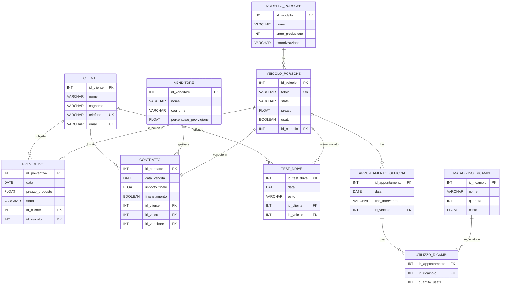

## Indice
- [Introduzione](#introduzione)
- [Analisi dei requisiti](#analisi-dei-requisiti)
- [Diagramma Entità-Relazione](#diagramma-er)
- [Schema Logico Relazionale](#schema-logico-relazionale)
- [Dizionario dei Dati](#dizionario-dei-dati)
- [Script SQL](#script-sql)
- [Conclusioni](#conclusioni)
- [Query per testare SQL](#query-per-testare-sql)

---

## Introduzione

  Il progetto riguarda la progettazione del database di una concessionaria Porsche, specializzata nella vendita di veicoli sportivi nuovi e usati. Il database ha lo scopo di gestire in modo ordinato veicoli, clienti, venditori e le principali attività commerciali della concessionaria.

---

## Analisi dei requisiti


  Il sistema deve permettere di:
 
  Gestire veicoli Porsche nuovi e usati con caratteristiche tecniche
 
  Gestire modelli Porsche
 
  Registrare clienti e storico acquisti
 
  Gestire venditori e provvigioni
 
  Creare preventivi e trattative
 
  Registrare contratti di vendita e finanziamenti
 
  Gestire servizio post-vendita e appuntamenti officina
 
  Gestire magazzino ricambi

---

### Vincoli richiesti:


  Un veicolo può avere più preventivi
 
  Un veicolo può essere venduto una sola volta
 
  Ogni veicolo ha uno stato: disponibile, riservato, venduto
 
  Prenotare test drive

---

## Diagramma ER




Spiegazione del Diagramma ER

Il diagramma Entità Relazione rappresenta le principali entità del sistema della concessionaria Porsche e le relazioni tra di esse.

Ogni veicolo Porsche appartiene a un solo modello, mentre un modello può essere associato a più veicoli. I clienti possono richiedere più preventivi e prenotare test drive per i veicoli disponibili.

Lo storico degli acquisti del cliente è sottointeso ed e possibile vederlo nel codice sql con l apposita query che va ad utilizzare le informazioni all interno dell entità clienti e contratti.

Un veicolo può essere oggetto di più preventivi ma può essere venduto una sola volta, come rappresentato dalla relazione uno a uno tra VEICOLO_PORSCHE e CONTRATTO. I venditori gestiscono i contratti di vendita e percepiscono una provvigione.

Sono inoltre gestiti gli appuntamenti in officina e il magazzino ricambi per il servizio post-vendita. Durante ogni intervento possono essere utilizzati più ricambi e ogni ricambio può essere utilizzato in più interventi: questa relazione molti a molti è gestita tramite l entità UTILIZZO_RICAMBI.

Schema Logico Relazionale

MODELLO_PORSCHE (

id_modello PK
nome
anno_produzione
motorizzazione
)

VEICOLO_PORSCHE (

id_veicolo PK
telaio
stato
prezzo
usato
id_modello FK
)

CLIENTE (

id_cliente PK
nome
cognome
telefono
email
)

VENDITORE (

id_venditore PK
nome
cognome
percentuale_provvigione
)

PREVENTIVO (

id_preventivo PK
data
prezzo_proposto
stato
id_cliente FK
id_veicolo FK
)

CONTRATTO (

id_contratto PK
data_vendita
importo_finale
finanziamento
id_cliente FK
id_veicolo FK
id_venditore FK
)

TEST_DRIVE (

id_test_drive PK
data
esito
id_cliente FK
id_veicolo FK
)

APPUNTAMENTO_OFFICINA (

id_appuntamento PK
data
tipo_intervento
id_veicolo FK
)

MAGAZZINO_RICAMBI (

id_ricambio PK
nome
quantita
costo
)

UTILIZZO_RICAMBI (

id_appuntamento FK
id_ricambio FK
quantita_usata
PK (id_appuntamento, id_ricambio)
)
Spiegazione delle scelte progettuali

MODELLO_PORSCHE

Ruolo: contiene le informazioni generali sui modelli Porsche prodotti, indipendentemente dai singoli veicoli.

Scelte progettuali:

id_modello come PK garantisce l’univocità di ogni modello.

Attributi come nome, anno_produzione e motorizzazione descrivono caratteristiche tecniche comuni a tutti i veicoli dello stesso modello.

Motivazione: separare il modello dal veicolo permette di evitare ridondanza dei dati, perché più veicoli possono appartenere allo stesso modello.

VEICOLO_PORSCHE

Ruolo: rappresenta ogni singolo veicolo disponibile in concessionaria o venduto.

Scelte progettuali:

id_veicolo come PK identifica in modo univoco ogni veicolo.

telaio è un attributo unico per identificare fisicamente la macchina.

stato e usato permettono di distinguere veicoli disponibili, venduti o in manutenzione.

id_modello come FK collega il veicolo al modello di appartenenza.

Motivazione: mantenere i dati specifici del veicolo separati dalle informazioni di modello consente maggiore flessibilità nella gestione del magazzino e delle vendite.

CLIENTE

Ruolo: raccoglie dati sui clienti del concessionario.

Scelte progettuali:

id_cliente come PK garantisce l’univocità.

Attributi come telefono e email facilitano il contatto e la gestione del CRM.

Motivazione: una tabella dedicata ai clienti permette di collegare preventivi, contratti e test drive senza duplicare dati.

VENDITORE

Ruolo: gestisce i venditori e le loro informazioni economiche.

Scelte progettuali:

percentuale_provvigione memorizza la commissione legata alle vendite.

id_venditore come PK mantiene l’identità unica.

Motivazione: separare venditori e contratti permette di calcolare provvigioni e performance senza modificare altre tabelle.

PREVENTIVO

Ruolo: rappresenta una proposta commerciale fatta al cliente.

Scelte progettuali:

PK id_preventivo identifica ogni preventivo.

FK id_cliente e id_veicolo collegano il preventivo rispettivamente al cliente e al veicolo.

stato indica se il preventivo è in corso, accettato o rifiutato.

Motivazione: permette di tracciare le trattative in corso senza interferire con i contratti ufficiali.

CONTRATTO

Ruolo: registra le vendite concluse e le eventuali informazioni su finanziamenti.

Scelte progettuali:

PK id_contratto per identificare univocamente ogni vendita.

FK id_cliente, id_veicolo e id_venditore collegano la vendita ai soggetti coinvolti.

importo_finale e finanziamento memorizzano i dettagli economici.

Motivazione: separare preventivi e contratti permette di distinguere trattative e vendite concluse, utile anche per report finanziari.

TEST_DRIVE

Ruolo: registra le prove su strada dei clienti.

Scelte progettuali:

PK id_test_drive identifica ogni prova.

FK id_cliente e id_veicolo collegano cliente e veicolo.

esito permette di sapere se il test drive è stato positivo o meno.

Motivazione: mantenere uno storico dei test drive aiuta a tracciare l’interesse dei clienti e le vendite potenziali.

APPUNTAMENTO_OFFICINA

Ruolo: gestisce il servizio post-vendita.

Scelte progettuali:

PK id_appuntamento identifica univocamente l’intervento.

FK id_veicolo collega l’appuntamento al veicolo.

tipo_intervento memorizza il tipo di manutenzione o riparazione.

Motivazione: separare gli appuntamenti dai veicoli consente gestione flessibile della pianificazione officina.

MAGAZZINO_RICAMBI

Ruolo: tiene traccia dei ricambi disponibili in officina.

Scelte progettuali:

PK id_ricambio per identificare ogni pezzo.

quantita e costo servono per gestire lo stock e il valore economico.

Motivazione: non è collegato direttamente ai veicoli ma agli interventi tramite UTILIZZO_RICAMBI, permettendo una gestione corretta del consumo dei ricambi.

UTILIZZO_RICAMBI

Ruolo: rappresenta l utilizzo dei ricambi durante gli interventi in officina.

Scelte progettuali:

PK composta (id_appuntamento, id_ricambio) per evitare duplicati.

FK verso APPUNTAMENTO_OFFICINA e MAGAZZINO_RICAMBI.

quantita_usata indica quanti pezzi sono stati utilizzati.

Motivazione: permette di gestire la relazione molti a molti tra interventi e ricambi e di tracciare con precisione l utilizzo dei materiali.

Considerazioni generali

Chiarezza e separazione dei concetti: ogni tabella ha un ruolo preciso (modello, veicolo, cliente, vendite, officina, ricambi).

Riduzione della ridondanza: i dati comuni ai veicoli (modello) o ai clienti non sono duplicati.

Integrità referenziale: tutte le FK collegano le tabelle coerentemente, evitando dati orfani.

Tracciabilità: grazie a preventivi, contratti, test drive e utilizzo dei ricambi, il sistema consente di seguire tutto il ciclo commerciale e post-vendita.

Scalabilità: lo schema permette di aggiungere nuovi clienti, veicoli, modelli, interventi o ricambi senza modificare la struttura.

Dizionario dei Dati

MODELLO_PORSCHE
Contiene le informazioni sui modelli di auto Porsche disponibili in concessionaria.

VEICOLO_PORSCHE
Rappresenta i singoli veicoli in vendita, nuovi o usati, con il relativo stato (disponibile, riservato, venduto).

CLIENTE
Contiene i dati anagrafici dei clienti della concessionaria.

VENDITORE
Raccoglie le informazioni sui venditori e sulla percentuale di provvigione.

PREVENTIVO
Gestisce le offerte economiche proposte ai clienti per l’acquisto dei veicoli.

CONTRATTO
Rappresenta la vendita effettiva del veicolo e può includere un finanziamento.

TEST_DRIVE
Gestisce le prenotazioni dei test drive effettuati dai clienti.

APPUNTAMENTO_OFFICINA
Registra gli appuntamenti per il servizio post-vendita.

MAGAZZINO_RICAMBI
Contiene i ricambi disponibili in officina.

UTILIZZO_RICAMBI
Rappresenta l utilizzo dei ricambi durante gli interventi di manutenzione.

__Script SQL__

Lo script SQL per la creazione del database e delle tabelle è contenuto nel file `database.sql` ed è stato testato per verificare il corretto funzionamento.

---

## Conclusioni

In questa fase del progetto è stata realizzata la progettazione del database per una concessionaria Porsche. Il lavoro comprende l’analisi dei requisiti, il diagramma ER, lo schema logico e il dizionario dei dati.


La struttura del database rispetta i vincoli richiesti dalla traccia e costituisce una base solida per le successive fasi di sviluppo dell’applicazione web.

---

## query per testare SQL

```sql
SELECT c.id_cliente, c.nome, c.cognome, co.id_contratto, co.data_vendita, co.importo_finale
FROM cliente c
JOIN contratto co ON c.id_cliente = co.id_cliente;
```

```sql
SELECT c.nome, c.cognome, co.id_contratto, co.data_vendita, co.importo_finale
FROM cliente c
JOIN contratto co ON c.id_cliente = co.id_cliente
WHERE c.id_cliente = 1;
```

```sql
SELECT vp.telaio, mp.nome AS Modello, mp.anno_produzione, mp.motorizzazione,
       vp.stato, vp.usato, vp.prezzo
FROM veicolo_porsche vp
JOIN modello_porsche mp ON vp.id_modello = mp.id_modello
WHERE vp.stato = 'Disponibile';
```

```sql
SELECT id_modello, nome, anno_produzione, motorizzazione
FROM modello_porsche;
```

```sql
SELECT id_venditore, nome, cognome, percentuale_provvigione
FROM venditore;
```

```sql
SELECT p.id_preventivo, c.nome, c.cognome, vp.telaio,
       p.prezzo_proposto, p.stato, p.data
FROM preventivo p
JOIN cliente c ON p.id_cliente = c.id_cliente
JOIN veicolo_porsche vp ON p.id_veicolo = vp.id_veicolo
ORDER BY p.data;
```

```sql
SELECT co.id_contratto, c.nome, c.cognome, vp.telaio,
       co.importo_finale, co.finanziamento, co.data_vendita
FROM contratto co
JOIN cliente c ON co.id_cliente = c.id_cliente
JOIN veicolo_porsche vp ON co.id_veicolo = vp.id_veicolo
ORDER BY co.data_vendita;
```

```sql
SELECT ao.id_appuntamento, ao.data, ao.tipo_intervento, vp.telaio
FROM appuntamento_officina ao
JOIN veicolo_porsche vp ON ao.id_veicolo = vp.id_veicolo
ORDER BY ao.data;
```

```sql
SELECT id_ricambio, nome, quantita, costo
FROM magazzino_ricambi
ORDER BY nome;
```

```sql
SELECT td.id_test_drive, c.nome, c.cognome, vp.telaio,
       td.data, td.esito
FROM test_drive td
JOIN cliente c ON td.id_cliente = c.id_cliente
JOIN veicolo_porsche vp ON td.id_veicolo = vp.id_veicolo
ORDER BY td.data;
```

    aggiunto tutte le parti ancora mancanti SQL, Conclusione, Query
    aggiornato Diagramma ER sintassi e intestazione
